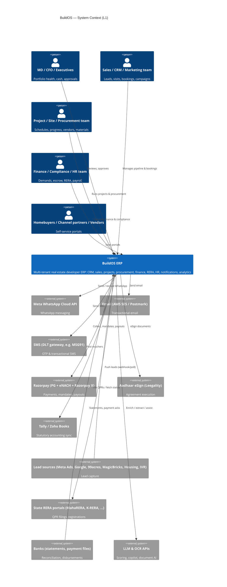

# 02 — Architecture (C4 Model)

Design-time C4 for BuildOS. Levels used: **Context (L1)**, **Container (L2)**, **Component (L3)**. Code level (L4) is deferred to implementation phases (agent work orders generate it per module). Diagrams are Mermaid C4 notation.

---

## 1. Level 1 — System Context

One system, five human actor groups + one external human (customer/partner/vendor) group, and the external systems BuildOS must integrate with.



**Context narrative**
- BuildOS is the **system of record** for the developer's commercial engine (lead→booking→demand→receipt→possession) and the **execution engine** (schedule→progress→procurement→cost), with statutory accounting left to Tally/Zoho (sync, not replace — a deliberate boundary, see ADR-01).
- All outbound human communication funnels through the Notification Hub so consent, templates, and audit are centralised.
- External actors never touch the internal ERP app; they get dedicated portal containers.

---

## 2. Level 2 — Containers

**Deployment shape (AWS ap-south-1):** ECS Fargate services behind CloudFront + ALB + API Gateway; RDS PostgreSQL 16 Multi-AZ (plus read replica); ElastiCache Redis; S3 + CloudFront for objects; MSK later (Redis Streams to start); OpenTelemetry → Grafana Cloud / Datadog; Terraform IaC; GitHub Actions CI/CD.

```mermaid
C4Container
    title BuildOS — Container diagram (L2)

    Person(user, "Internal users", "ERP web/mobile")
    Person(cust, "Homebuyer", "Customer portal")
    Person(cp, "Channel partner", "Partner portal")
    Person(vend, "Vendor/Contractor", "Vendor portal")

    System_Boundary(c1, "BuildOS") {
        Container(erp, "ERP Web App", "Next.js 15 / React 19 / TypeScript", "Internal ERP SPA+RSC app; role-scoped modules")
        Container(cportal, "Customer Portal", "Next.js 15", "Homebuyer self-service + PWA")
        Container(pportal, "Partner & Vendor Portal", "Next.js 15", "Shared external-facing app, 2 role families")
        Container(fieldapp, "Field Mobile Web (PWA)", "Next.js 15 (mobile-first)", "Site engineer / CRM on ground; offline-tolerant")

        Container(api, "Core API (modular monolith)", "NestJS / TypeScript", "Bounded contexts: identity, crm, sales, projects, procurement, finance, compliance, hr, workflow, docs, notifications, analytics")
        Container(notifsvc, "Notification Service", "NestJS worker", "WhatsApp/email/SMS/push orchestration")
        Container(jobs, "Job Workers", "BullMQ workers", "Demand engine, dunning, recon, OCR, scoring, report gen")
        Container(search, "Search", "Typesense/PG FTS", "Global search, document search")

        ContainerDb(pg, "PostgreSQL 16 (RLS)", "RDS Multi-AZ", "System of record; schemas per bounded context")
        ContainerDb(redis, "Redis 7", "ElastiCache", "Cache, queues, rate limits, sessions")
        ContainerDb(s3, "Object Store", "S3 + CloudFront", "Documents, media, exports")
        ContainerDb(wh, "Warehouse (Phase 5)", "ClickHouse/PG", "Analytics store")
    }

    Rel(user, erp, "Uses")
    Rel(cust, cportal, "Uses")
    Rel(cp, pportal, "Uses")
    Rel(vend, pportal, "Uses")
    Rel(projects, fieldapp, "Uses on site")

    Rel(erp, api, "HTTPS/JSON + SSE")
    Rel(cportal, api, "HTTPS/JSON")
    Rel(pportal, api, "HTTPS/JSON")
    Rel(fieldapp, api, "HTTPS/JSON")

    Rel(api, pg, "Prisma, RLS-enforced")
    Rel(api, redis, "Cache / queues")
    Rel(api, s3, "Presigned PUT/GET")
    Rel(jobs, pg, "Batch processing")
    Rel(notifsvc, redis, "Queue consume")
    Rel(search, pg, "Index source")

    Rel(api, notifsvc, "Events over Redis Streams")
    Rel(jobs, notifsvc, "Notification jobs")
```

### Container catalogue

| Container | Tech | Responsibility | Scaling |
|---|---|---|---|
| ERP Web App | Next.js 15, React 19, TS, Tailwind v4, shadcn/ui | Internal ERP UI; module-per-route code split; RBAC-driven IA | Stateless, CDN+ISR |
| Customer Portal | Next.js 15 | Homebuyer self-service; must survive launch-day spikes | Stateless, edge-cached marketing pages |
| Partner & Vendor Portal | Next.js 15 | Inventory view, lead import, RFQ/bill submission | Stateless |
| Field PWA | Next.js 15 mobile-first | Site reports, attendance, leads; offline queue | PWA service worker |
| Core API | NestJS modular monolith, Prisma, OpenAPI-first | All business logic in 12 bounded contexts; REST + SSE; authn/z | Horizontal pods; context-level extraction path defined |
| Notification Service | NestJS workers | Channel adapters, journeys, consent | Worker autoscale by queue depth |
| Job Workers | BullMQ/Redis | Demand engine, dunning, bank recon, OCR, nightly scoring, QPR drafts, exports | Worker autoscale |
| PostgreSQL 16 | RDS | Single logical DB, schema-per-context, **RLS on tenant_id** | Vertical + read replicas; per-tenant sharding contingency |
| Redis 7 | ElastiCache | Queues, cache, rate limiting, pub/sub for SSE | Cluster mode when >25 GB |
| S3 | — | Documents (SSE-KMS), media, exports | — |
| Warehouse | ClickHouse (Phase 5) | Analytics marts via CDC (Debezium) or ELT jobs | Start with PG replica if <50 GB |

### Key ADRs

| ADR | Decision | Rationale | Alternatives rejected |
|---|---|---|---|
| ADR-01 | Modular monolith (not microservices) at v1; boundaries enforced by code + schema; extraction path documented | Small eng team; ERP transactional integrity; ship fast; monolith→services via strangler when a context needs independent scale (notifications first) | Microservices from day 1 (ops cost), serverless (ERP long transactions, cold starts) |
| ADR-02 | Postgres RLS for tenant isolation + app-level tenant guard | Defence in depth; one DB is simplest to run; RLS makes tenant leakage a DB-level impossibility | Schema-per-tenant (migration pain), DB-per-tenant (cost) |
| ADR-03 | TypeScript end-to-end (Next.js + NestJS + Prisma) | Shared types/OpenAPI codegen, one hiring pool, excellent tooling | Java/Spring (heavier), Python/FastAPI (two-language stack for no gain) |
| ADR-04 | Accounting stays in Tally/Zoho; BuildOS owns sub-ledgers + syncs vouchers | Statutory/accountant ecosystem reality in India; avoids re-implementing statutory accounting | Full GL in BuildOS (huge compliance surface) |
| ADR-05 | In-house lightweight workflow engine (state machines in Postgres) over Temporal | Approval matrices + SLA needs are simple; no new infra; revisit Temporal if long-running sagas dominate | Temporal v1 (operational overhead), Camunda (JVM stack) |
| ADR-06 | Redis Streams for events now; Kafka-compatible envelope so MSK swap is config-level | Event-driven boundaries from day 1 without Kafka ops | Kafka day 1 (overkill at this scale) |
| ADR-07 | WhatsApp-first for customer comms (email secondary, SMS for OTP/critical) | India homebuyer reality; WhatsApp HSM deliverability > email; DLT-compliant SMS for OTP | Email-first (poor open rates in this segment) |

---

## 3. Level 3 — Components (Core API bounded contexts)

```mermaid
C4Component
    title Core API — Bounded Contexts (L3)

    Container_Boundary(api, "Core API (NestJS modular monolith)") {
        Component(identity, "Identity & Access", "NestJS ctx", "Authn (OTP/MFA/SSO), users, roles, permissions, scopes, sessions")
        Component(tenancy, "Tenancy & Org", "NestJS ctx", "Tenants, entities/SPVs, verticals, projects, org tree, settings")
        Component(workflow, "Workflow Engine", "NestJS ctx", "State machines, approval chains, SLA timers, delegation")
        Component(crm, "CRM", "NestJS ctx", "Leads, scoring, routing, visits, pipeline, attribution links")
        Component(sales, "Sales & Inventory", "NestJS ctx", "Units, pricing, plans, holds, bookings, AFT, partners, commissions")
        Component(marketing, "Marketing", "NestJS ctx", "Campaigns, spend, attribution, creatives")
        Component(projects, "Projects", "NestJS ctx", "WBS, schedule, milestones, progress, QC, HSE, approvals register")
        Component(procure, "Procurement", "NestJS ctx", "Vendors, RFQ/PO/work orders, BOQ, RA bills, materials")
        Component(finance, "Finance", "NestJS ctx", "Demands, receipts, escrow, costing, AP, GST/TDS, lender packs, Tally sync")
        Component(compliance, "RERA & Compliance", "NestJS ctx", "Registrations, QPR drafts, statutory calendar, complaints, litigation, DPDP consents")
        Component(hr, "HR & Payroll", "NestJS ctx", "Employees, attendance, payroll, incentives, contractor labour")
        Component(portal, "Portal BFF", "NestJS ctx", "Customer/partner/vendor aggregation APIs, OTP auth")
        Component(notify, "Notification Hub ctx", "NestJS ctx", "Templates, journeys, consent ledger, message log (service = worker container)")
        Component(docs, "Documents & eSign", "NestJS ctx", "Vault, versions, OCR, eSign journeys, watermarking")
        Component(analytics, "Analytics & AI", "NestJS ctx", "Semantic layer, report packs, AI services (scoring, copilot, doc AI)")
        Component(audit, "Audit", "NestJS ctx", "Append-only event log, exports")
    }

    Rel(crm, sales, "Won → booking initiation")
    Rel(sales, finance, "Booking → demand schedule")
    Rel(projects, finance, "Milestone certified → demand trigger, cost accrual")
    Rel(finance, compliance, "Escrow data → RERA QPR")
    Rel(sales, workflow, "Discount/booking approvals")
    Rel(procure, workflow, "PO/RA-bill approvals")
    Rel(finance, docs, "Statements, eSign AFT")
    Rel(crm, notify, "Journey triggers")
    Rel(finance, notify, "Demand reminders")
    Rel(compliance, docs, "Statutory evidence")
    Rel(hr, finance, "Payroll GL, incentives")
```



### Component contracts (cross-context rules)

1. **Contexts never share tables.** Cross-context reads go through published read-models or internal APIs; writes through domain events.
2. **Event envelope** (Kafka-compatible): `{id, tenantId, occurredAt, context, type "crm.lead.created.v1", payload, actor, correlationId, causationId}` — versioned, consumers pin minor versions.
3. **Golden events (v1 core):** `lead.created/qualified/converted`, `unit.held/booked/cancelled`, `booking.confirmed`, `aft.executed`, `demand.generated/due/overdue`, `receipt.cleared/bounced`, `milestone.certified`, `progress.updated`, `rabill.approved/paid`, `qpr.drafted/submitted`, `commission.accrued/paid`, `complaint.raised/resolved`, `employee.attendance.marked`, `payroll.processed`.
4. **AI consumers:** the same event stream feeds the AI operating layer (12 agents, decision engine, autonomy policy L0–L5). Agent subscriptions, AI-origin events (`ai.insight_created`, `bill.anomaly_detected`, `project.risk_changed`, …), and the rule that agents act only via policy-gated tools are specified in `docs/architecture/11-event-architecture.md` and `07–10` of that directory. This outbox/envelope is the transport for both human-facing and AI consumers.
4. **Money discipline:** all amounts integer paise; all currency ops via Money value object; GST/TDS computations in a shared `tax` library with effective-dated rate tables.

---

## 4. Tenancy & org model

```
Tenant (developer company)
 └─ Entity (legal company / SPV)  ← books of account, GST registrations, Tally company
     └─ Vertical (Residential / Commercial / Plotted …)   ← reporting segmentation
         └─ Project (RERA registration boundary)  ← the working unit for 90% of screens
             └─ Tower/Block → Floor → Unit
Cross-cutting: Users, Roles, Vendors, Channel Partners, Employees live at Tenant level;
project/entity scoping via RBAC data-scope assignments.
```

- **Segment polymorphism:** `Project` carries `segmentKind` (residential|commercial|plotted|mixed|redevelopment); inventory trees and milestone templates differ per segment via templates, not forks.
- **JV/JD land model:** project can have `partners[]` (landowner share %) — affects revenue splits in finance reporting (P2).

---

## 5. Core data model (v1 entities by context)

> Full columnar DDL is generated in Phase 0/1 agent work orders; this is the canonical entity map.

| Context | Entities (key fields) |
|---|---|
| Tenancy | `Tenant`, `OrgEntity`, `Vertical`, `Project(segmentKind, state, reraNo, dates)`, `Tower`, `Floor`, `Unit(area, state, currentBookingId)` |
| Identity | `User`, `Role`, `Permission`, `UserRole(scope: entity/project)`, `Session`, `MfaSecret`, `ApiKey` |
| Workflow | `WorkflowDef`, `WorkflowInstance`, `Task(approver, slaDue)`, `Delegation` |
| CRM | `Lead(source, utm, score)`, `Opportunity(stage)`, `SiteVisit`, `Call/Interaction`, `LeadJourneyState` |
| Sales | `PriceList(effective)`, `PaymentPlanTemplate`, `PaymentMilestone`, `Hold`, `Quote`, `Booking(unit, priceBook snapshot, plan)`, `AftDoc`, `Cancellation`, `ChannelPartner`, `CommissionPlan`, `CommissionLedgerEntry`, `PayoutBatch` |
| Marketing | `Campaign(channel, budget)`, `SpendEntry`, `Creative`, `AttributionLink` |
| Projects | `WbsNode`, `Activity(dep, dates)`, `Milestone(certs[])`, `ProgressSnapshot`, `SiteReport`, `QcChecklist`, `Snag`, `ApprovalDoc(expiry)`, `Incident` |
| Procurement | `Vendor(complianceDocs)`, `Indent`, `Rfq`, `ComparisonSheet`, `WorkOrder/PO(terms)`, `BoqItem`, `MeasurementEntry`, `RaBill(deductions)`, `MaterialItem`, `StockLedger`, `Grn`, `MaterialIssue` |
| Finance | `Demand(unit, schedule)`, `Receipt(instrument, clearing)`, `CustomerLedger`, `InterestPosting`, `EscrowAccount`, `EscrowWithdrawal(certs)`, `BudgetLine`, `ActualCost`, `ApInvoice`, `PaymentRun`, `TaxPosting`, `VoucherSync(tally)` |
| Compliance | `ReraRegistration`, `QprFiling(quarter, status, draftJson)`, `StatutoryItem(owner, due, evidence)`, `Complaint`, `LitigationCase`, `ConsentLedger` |
| HR | `Employee`, `AttendanceRecord(geo)`, `LeaveLedger`, `PayrollRun`, `IncentiveScheme`, `IncentiveEntry`, `ContractorMuster` |
| Platform | `Document(vault)`, `DocumentVersion`, `EsignRequest`, `NotificationTemplate`, `MessageLog(channel, status)`, `Journey`, `AuditEvent` (append-only), `NumberSeries` |

**Tenancy enforcement:** every tenant-owned table has `tenant_id NOT NULL`; Postgres RLS policy `tenant_id = current_setting('app.tenant_id')::uuid`; Prisma middleware injects the GUC per request; entity/project scoping is application-level (RBAC), audited.

---

## 6. NFR targets

| Concern | Target |
|---|---|
| Availability | 99.9% overall; booking/portal paths 99.95% in business hours |
| Latency | p95 <300 ms API; p99 <800 ms; portal LCP <2.5 s |
| Burst | 500 req/s for 15 min (launch day), graceful queue for booking creation |
| Data durability | RPO ≤15 min (PITR + cross-region copy), RTO ≤4 h |
| Throughput scale headroom | 50 tenants / 10k users / 1M leads-yr without re-architecture |
| Security | OWASP ASVS L2, secrets in AWS Secrets Manager + rotation, KMS envelope encryption, VAPT pre-launch |
| Observability | 100% trace sampling on errors; RED/USE dashboards; audit 7-year retention |
