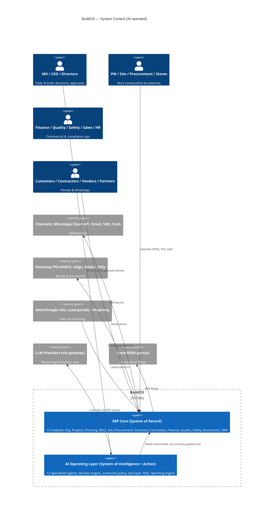

# 01 — System Overview: BuildOS — AI-Operated Construction ERP

Acting as Principal Enterprise / Construction Technology / AI Systems / Product / Security Architect.

## 1. Product vision

BuildOS is a **production-grade, AI-operated construction management platform** for real-estate developers, builders, contractors, and construction companies — sized for a ₹500 Cr/yr developer operating across residential, commercial, plotted, mixed-use, and redevelopment segments (`../../01-product-requirements.md §1`).

**The goal is not a generic ERP with a chatbot.** The defining property:

- The **ERP is the System of Record** — deterministic, permission-enforced, auditable. Every unit, demand, rupee, measurement, and certificate lives here.
- The **AI layer is the System of Intelligence + Action** — continuously monitoring operations through the event stream, detecting risks, preparing decisions with evidence, automating repetitive work, generating reports, and executing **only approved low-risk actions** through a policy-gated tool layer.

Humans decide; AI watches, warns, prepares, and executes the routine. Every AI action is authorized, evidence-backed, and audit-logged — security is enforced **outside** the model.

## 2. Architecture at a glance

## 3. Operating thesis — where AI acts

| Repetitive human work today | AI-operated behavior | Autonomy |
|---|---|---|
| Site progress compiled manually | Progress Agent computes planned-vs-actual, flags delays nightly | L0–L1 |
| Bill checking by quantity surveyor | Billing Verification Agent compares bill·MB·BOQ, flags anomalies, recommends | L1 + L4 approval |
| Material shortage surprises | Material Intelligence Agent forecasts days-of-cover, drafts PRs | L2 draft, L4 execute |
| Cost overruns found at month-end | Cost Control Agent tracks commitments continuously, predicts EAC breach | L1 |
| Reports assembled by analysts | Reporting engine generates daily/weekly/monthly packs from ERP data | L3 |
| Safety walk findings lost in photos | Safety Agent classifies observations, opens CAPA tasks | L3 |
| Executive "what's happening?" chats | Management Intelligence Agent's daily brief + ask-AI (permission-scoped) | L0–L3 |

Full autonomy model: `10-ai-autonomy-policy.md`. Agent specifications: `08-ai-agent-specifications.md`.

## 4. Design principles (binding on all modules)

1. ERP is the system of record; AI is the system of intelligence and action.
2. AI never bypasses authorization — it inherits user/scope context (service identity) and passes the same policy engine as humans.
3. High-impact actions require explicit human approval (L4); some actions are prohibited autonomously (L5).
4. Every AI action is auditable end-to-end (agent, model, prompt version, inputs, tools, decision, confidence, approval, result).
5. Every important recommendation carries evidence links (records, documents, computations).
6. Deterministic business logic for all arithmetic (money, schedules, EVM, GST/TDS, escrow); **LLMs are never the source of truth for financial computation** — they classify, extract, summarize, and explain.
7. Structured tools for ERP operations; no agent holds raw DB write credentials.
8. Agents are narrowly scoped (registry + tool allowlist + autonomy ceiling each).
9. Workflows idempotent; failures recoverable (outbox, DLQ, replay).
10. Multi-tenancy and project-level isolation from day one.
11. Avoid unnecessary microservices — the AI layer lives in the same modular monolith/deployment until scale proves otherwise (ADR-01, ADR-AI1).
12. Reuse the existing documented stack: TypeScript / NestJS / Next.js 15 / Prisma / PostgreSQL 16 (RLS + pgvector) / Redis 7 / BullMQ / S3 (`../../03-backend-architecture.md`).

## 5. Document map

| Layer | Files |
|---|---|
| Vision & current state | 01, 02, 03 |
| Domain & data | 04, 05, 06 |
| AI operating layer | 07, 08, 09, 10, 15, 28 |
| Events, workflows, reporting | 11, 12, 13, 14 |
| Platform & governance | 16, 17, 18, 19, 20, 21 |
| Experience & delivery | 22, 23, 24, 25, 26, 27 |
| Governance records | 28, 29, 30, ARCHITECTURE-REVIEW |
| Effort baseline | [31-effort-estimation.md](31-effort-estimation.md) — per-work-package hour budgets, team/scenario translation, agent-compression model |
| Multi-agent delivery | [32-multi-agent-execution.md](32-multi-agent-execution.md) — 13-role agent roster, ownership map, parallel lanes, dispatch schedule, orchestration protocol |

Legacy planning package (`../../01…12`, `../../phases/`) remains valid and is referenced throughout as the detailed ERP specification; this package adds the AI operating layer and production architecture on top of it.
