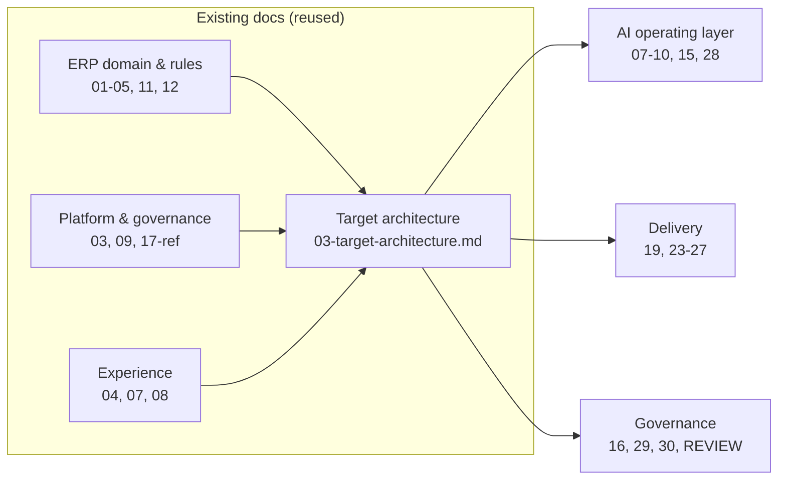

# 02 — Current-State Analysis (Repository Discovery)

Discovery performed on this workspace per the discovery mandate. Evidence: filesystem inventory + grep of committed documents (commands and outputs recorded below). **Nothing here is invented; unverifiable implementation facts are marked `UNKNOWN — REQUIRES CONFIRMATION`.**

## 1. Repository inventory (evidence: `find . -type f`)

```
real-estate-erp/
├── README.md                     # Executive summary, 12-module map, doc index
├── 01-product-requirements.md    # Personas, ~120 FRs, 12 India-specific business rules
├── 02-architecture-c4.md         # C4 L1/L2/L3 (Mermaid), 7 ADRs, entity map, NFRs
├── 03-backend-architecture.md    # API standards, RBAC+ABAC, workflow engine, events, security, testing
├── 04-frontend-design.md         # Design system, IA, screen inventory, perf/a11y budgets
├── 05-integrations.md            # WhatsApp/email/SMS/payments/eSign/Tally/RERA
├── 06-execution-plan.md          # 7-phase roadmap, 3 workstreams, risks
├── 07-micro-management.md        # Task envelope, role micro-days, checklists, exception queues
├── 08-dashboards.md              # 12 dashboard designs with wireframes
├── 09-approval-system.md         # Authority matrices, SLA ladders, SoD
├── 10-integrations-sales-marketing.md  # 29 sales/marketing integrations
├── 11-project-management-deepdive.md   # WBS templates, CPM, EVM, QC gates
├── 12-rera-deepdive.md           # Statute map, state profiles, QPR field mapping
└── phases/phase-0…6.md           # 7 agent-executable work orders
```

## 2. What already exists (evidence-based)

| Area | Finding | Evidence |
|---|---|---|
| Architecture documentation | Comprehensive C4 (Context/Container/Component), 7 ADRs | `../../02-architecture-c4.md` |
| Stack decision (recorded) | TypeScript, NestJS modular monolith, Next.js 15/React 19, Prisma, PostgreSQL 16 + RLS, Redis 7, BullMQ, S3, OpenAPI-first, outbox→Redis Streams | grep hits in README/02/03 (recorded in discovery log) |
| Domain design | 13-module ERP incl. construction (Planning, BOQ, Site, Procurement, Inventory, Contractors, Quality, Safety) | `../../01 §M1–M12`, `11-PM-deepdive` |
| Governance design | RBAC+ABAC 3-layer enforcement, 20 seeded roles, authority matrices, SoD | `../../03 §2`, `../../09` |
| Workflow/process design | Event catalogue + outbox, BullMQ job list, exception queues, SLA ladders | `../../03 §4`, `../../07 §5` |
| AI intentions (partial) | Phase 5 AI services, LLM gateway idea, scoring/copilot/OCR sketches | `../../01 §M12`, `../../05 §9`, `phases/phase-5` |

## 3. What does NOT exist (no code in repository)

Verified: no `package.json`, no lockfiles, no `.ts/.tsx` sources, no Prisma schema, no migrations, no Dockerfiles, no CI config, no tests. **This is a greenfield documentation repository.** All "existing code" claims would be false; per the mandate, implementation-status items are:

- Application routes, API routes, DB layer, auth implementation: **not built — UNKNOWN — REQUIRES CONFIRMATION** only in the sense that no separate production repo was provided. If a codebase exists elsewhere, re-run discovery there before Phase 0.
- Existing AI functionality, reporting/CRM/financial code: **none present in this repository.**
- Environment configuration, CI/CD, deployment configs: **none present.**

## 4. Assessment of the existing documentation (the real current state)

**Reusable as-is (do not redesign):**
- ERP domain model, hierarchies (Company→Project→Tower→Floor→Unit), unit state machines, demand/receipt/escrow logic — `01`, `02 §5`.
- Stack and tenancy decisions (ADR-01…07) — `02`.
- Micro-management model (task envelope, checklists, exception queues) — `07`. This is the backbone the AI layer plugs into.
- Approval system (authority matrices, SoD, WhatsApp approvals) — `09`. The AI approval engine extends this; human pathways are unchanged.

**Incomplete relative to the AI-operated objective (gaps this package fills):**
1. No AI operating layer spec (agents, autonomy, decision engine, tool contracts, AI audit tables) → files 07–10.
2. No RAG/document-intelligence architecture → file 15.
3. No event→AI-workflow binding (events existed; AI consumers undefined) → file 11.
4. Reporting engine exists as dashboards only; no automated daily/weekly/monthly generation → file 13.
5. KPIs scattered across docs; no single framework → file 14.
6. Roadmap had 7 phases without explicit AI maturity phases → file 27 (Phases 0–9).
7. No DR file, cost model, risk register, consolidated ADR set → files 24, 28, 29, 30.

**Contradictions / problems found (and resolved):**
- `01 §M12` implies ML scoring "nightly" without an AI governance wrapper → superseded by autonomy policy (all L0–L3).
- `phases/phase-5` introduces AI features ad hoc → replaced by Phases 6–8 in `27-implementation-roadmap.md`; Phase 5 file remains for ERP analytics only.
- Dashboard set lacked an AI Command Center → added as D13 in `22-frontend-architecture.md`.

**Technical debt:** none executable (no code). Documentation debt = contradictions above, now reconciled.

**Security risks (of the plan as it stood):** AI features in `phase-5` had no prompt-injection, tool-abuse, or output-gating controls → addressed in `16-security-architecture.md` before any AI phase executes.

**Production-readiness requirement:** full checklist in `26-production-readiness.md`; honest verdict in `ARCHITECTURE-REVIEW.md` (documentation is strong; **nothing is production-ready because nothing is built** — score reflects reality, not the plan's ambition).

## 5. Repository architecture map (for the target proposal)


