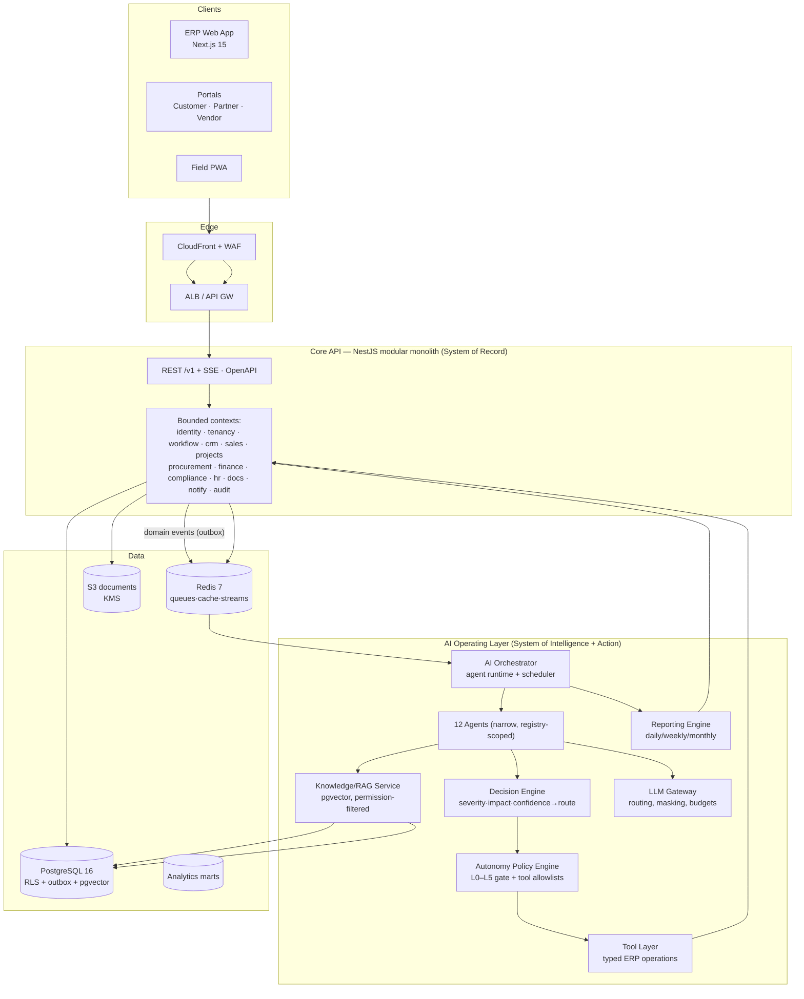

# 03 — Target Architecture

## 1. High-level architecture

**Key architectural facts (all reuse the existing documented stack — evidence in `02 §2`):**

| Concern | Decision | Basis |
|---|---|---|
| Runtime topology | One NestJS modular monolith for ERP + AI layer contexts, separate worker processes for jobs/agents (same image, different entrypoints) | ADR-01, ADR-AI1 in `30-architecture-decisions.md` |
| AI trigger model | Event-driven: outbox events → Redis Streams → orchestrator; plus BullMQ crons for scheduled analysis | `../../03 §4` (mechanism exists in plan) |
| AI write path | **Only** through the same policy-gated tool layer humans use — never direct DB writes | `10-ai-autonomy-policy.md` |
| RAG storage | **pgvector extension on the existing PostgreSQL 16** — no separate vector DB until >10M chunks (ADR-AI4) | reuses committed stack |
| LLM access | Single LLM Gateway module: model routing, PII masking, cost budgets, response caching | `28-ai-cost-model.md` |
| Approvals | AI action approvals reuse the human approval engine (`../../09`) — one inbox, unified audit | ADR-AI2 |

## 2. Placement of AI contexts (modular monolith boundaries)

New bounded contexts inside the Core API / workers, each with its own schema (no cross-schema writes):

- `ai_orchestration` — agent registry, runs, schedules
- `ai_decisions` — observations→analysis→decision records, evidence links
- `ai_actions` — tool-call requests, policy verdicts, approvals, execution results
- `ai_memory` — project/operational/user/agent memory (§ 07)
- `knowledge` — document chunks, embeddings (pgvector), retrieval logs
- `reporting` — report definitions, generated artifacts, distribution log

## 3. What changes vs. what does not

| Unchanged (evidence) | Added |
|---|---|
| ERP contexts, RLS tenancy, approval engine, workflow engine, notification hub, micro-management task model | AI orchestrator + agents, decision & policy engines, tool layer, RAG, reporting engine, AI tables, AI Command Center UI, AI eval harness |

The ERP's public behavior, permissions, and data model are **not redesigned**; the AI layer is strictly additive and reads the same events humans' dashboards do.

## 4. Non-functional targets (MVP → production → scale)

| NFR | MVP (Phase 6 exit) | Production (Phase 9 exit) | Scale (50 tenants) |
|---|---|---|---|
| Availability | 99.5% | 99.9% (booking paths 99.95%) | 99.95% multi-AZ |
| API p95 | <500 ms | <300 ms | <300 ms @500 rps |
| AI: brief generation | ≤5 min after trigger | ≤3 min (p95) | ≤3 min |
| AI: ask-AI answer | ≤8 s | ≤5 s p95 | ≤5 s |
| Tool-call round trip | ≤2 s | ≤1.5 s | ≤1.5 s |
| Report generation (monthly pack) | ≤15 min | ≤10 min | ≤10 min |
| RPO / RTO | 1 h / 8 h | 15 min / 4 h | 15 min / 2 h warm |
| AI cost cap | hard per-tenant budget | per-agent budgets + alerts | pooled + chargeback |
| Model failure behavior | degrade to deterministic | degrade + queue replay | multi-provider failover |

Other NFRs (availability mechanics, security, retention) — `16`, `21`, `23`, `24`.
