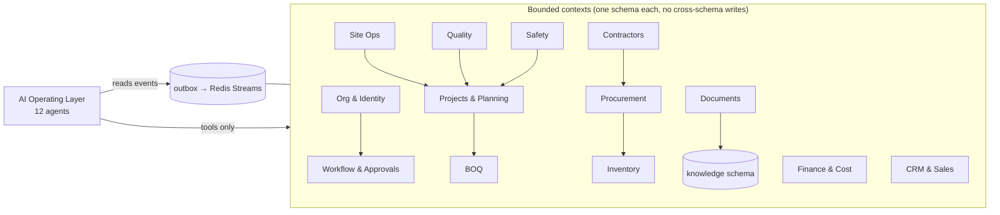

# 04 — Domain Model (Construction ERP)

Canonical domain for the AI-operated platform. Hierarchies and module entities below; detailed business rules live in the legacy package (`../../01 §M1–M12`, `../../11`, `../../12`) and remain authoritative.

## 1. The four hierarchies

## 2. The 13 core modules — entity map

| # | Module | Key entities (owner context) | Detail source |
|---|---|---|---|
| 1 | **Organization** | Tenant, OrgEntity, Branch, Department, Team, User, Role, Permission, UserRole(scope) | `../../03 §2`, `../../02 §5` |
| 2 | **Project Management** | Project(segmentKind, phase, status, health), Tower, Floor, Unit(state machine), Milestone, ProjectHealthSnapshot | `../../01 §M2–M3`, `../../02 §5` |
| 3 | **Construction Planning** | WbsNode, Activity(deps, dates), Task, Baseline(+revisions), ScheduleState, PlannedProgress, ActualProgress, ForecastProgress | `../../11 §1–2` |
| 4 | **BOQ** | Boq(header, revision), BoqItem(qty, unit, rate, amount), approved_qty, consumed_qty, linked Activity | `../../11 §1`, `../../01 §M6` |
| 5 | **Site Management** | DailyProgressReport, SiteDiary, LabourAttendance(muster), WorkProgressEntry, SitePhoto(geo), SiteIssue, WeatherLog, EquipmentUsage | `../../11 §5–6`, `../../07 §3` |
| 6 | **Procurement** | MaterialRequirement, PurchaseRequisition(indent), Rfq, VendorQuotation, ComparisonSheet, PurchaseOrder, GoodsReceipt, approvals | `../../01 §M6`, `phases/phase-3` |
| 7 | **Inventory** | Material, MaterialCategory, Warehouse(site/central), Stock(lot), StockMovement, Consumption, Return, Transfer, ReorderLevel | `phases/phase-3 WP-3F` |
| 8 | **Contractor Management** | Contractor(complianceDocs), Contract, Scope, WorkOrder, BoqAllocation, MeasurementBook entry, RaBill(deductions), Retention, Advance, ContractorPayment | `../../01 §M6`, `../../09 §2` |
| 9 | **Finance** | Budget(codes), CostCode, ActualCost, Commitment, Expense, Payable, Receivable, Payment, CashFlow, CostVariance, Demand/Receipt/Escrow (sales-side) | `../../01 §M7`, `phases/phase-2` |
| 10 | **Quality** | Inspection, Checklist(template+instance), NCR, Defect, CorrectiveAction(CAPA), Approval, QualityScore | `../../11 §7` |
| 11 | **Safety** | SafetyInspection, Incident, NearMiss, Hazard, CorrectiveAction, SafetyChecklist, SafetyScore | `../../11 §8` |
| 12 | **Document Management** | Document, DocumentVersion/Revision, eSignRequest, Drawing(register), contract/BOQ/invoice/certificate classes, RAG chunks (15) | `../../03 WP-0F`, `15-document-intelligence.md` |
| 13 | **CRM / Sales** | Lead, Customer, SiteVisit, Opportunity, UnitAvailability, Booking, Agreement(AFT), PaymentSchedule, Demand, Receipt — **separate context, connected only via explicit events** (lead.won→booking; unit reservation) | `../../01 §M2–M3`, `phases/phase-1` |

**Separation rule:** construction (modules 2–12) and sales (module 13) never share tables; the only contract is `unit.reserved/booking.confirmed` events and the unit's booking pointer.

## 3. ERP module architecture

## 4. Cross-cutting domain rules (summary; authoritative in legacy docs)

- Money: integer paise; GST/TDS via effective-dated tax engine (`../../03 §1`).
- Unit state machine: `available→held→blocked→booked→registered→cancelled` (`phases/phase-1 WP-1C`).
- Milestone certification gates demands and RERA progress (`../../11 §3`).
- 3-way match (WO/BOQ ↔ MB ↔ bill) is the billing truth (`../../01 §M6.4`).
- 70% RERA escrow classification is a finance invariant (`../../12 §4`).
- Every write: audit event; every statutory doc: gapless numbering (`../../01 BR-L`).
- AI may only observe these invariants, never compute them (principle 6).
