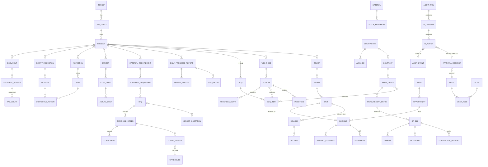

# 06 — Entity Relationship Model (Core ERD)

Mermaid ERD of the principal entities across the four hierarchies + AI layer. Attribute lists are abbreviated to identity + key relations; full field-level DDL is generated in Phase 0–3 work orders (`../../phases/`).

**Isolation notes:** every entity above carries `tenant_id` (RLS); construction entities carry `project_id` scoped by RBAC; `APPROVAL_REQUEST` is the unified human+AI approval table from `../../09 §1` extended with `source = human | ai_agent` and `ai_action_id` — one approval inbox, one audit trail. Financial/statutory rows are never hard-deleted (`05 §4`).
