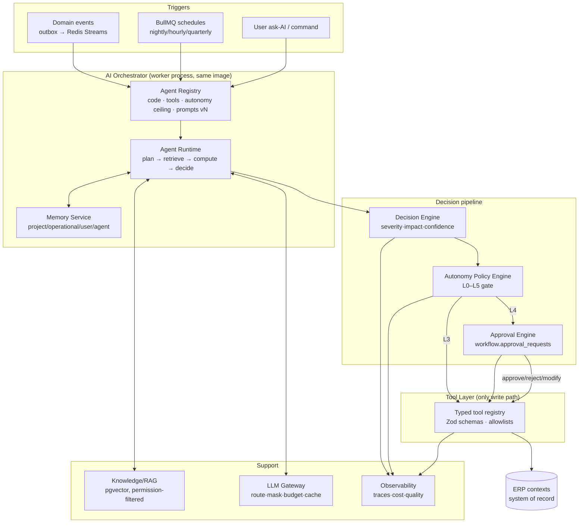
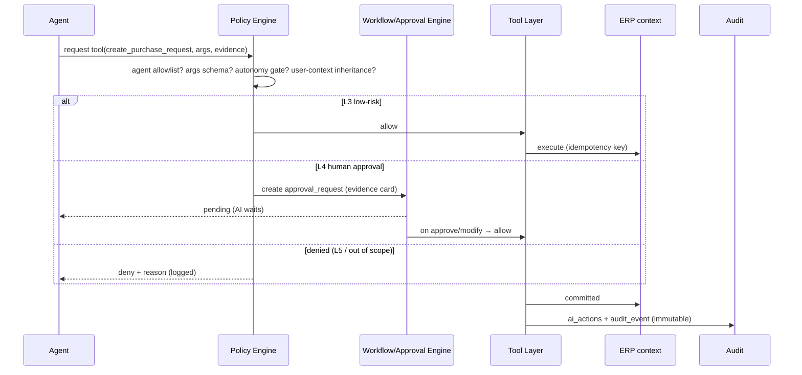

# 07 — AI Agent Architecture

The AI operating layer: how agents are registered, triggered, execute within boundaries, remember, and fail safely. ERP remains the system of record; agents act **only** through the policy-gated tool layer.

## 1. Agent system overview

## 2. Agent registry (every agent declares)

| Field | Example (Procurement Agent) |
|---|---|
| `code` | `procurement_agent` |
| `version` | prompt/config version, pinned per run |
| `triggers` | `material.low_stock`, `material.shortage.predicted`, cron 06:00 IST |
| `tools` (allowlist) | `read_inventory`, `read_open_pos`, `read_consumption_history`, `create_purchase_request` (L2), `notify_role` (L3) |
| `autonomy_ceiling` | L2 (PRs are drafts; POs always human) |
| `data_scope` | tenant + projects assigned by trigger payload |
| `memory` | project (lead times, vendor quirks), operational (recent shortages) |
| `failure_policy` | retry ×3 backoff → skip + incident task |
| `cost_budget` | ₹/day cap, model tier (`28 §2`) |

Agents are **data**: registry rows + versioned prompt bundles; adding an agent requires no core-code change.

## 3. Agent runtime loop (deterministic core, LLM at the edges)

1. **Trigger** — event/correlation; dedupe via `processed_events` (idempotent, principle 9).
2. **Assemble context** — structured facts pulled via read tools (NOT raw DB): KPIs, records, recent events, memory, RAG citations (permission-filtered).
3. **Compute deterministically first** — EVM, days-of-cover, variance, aging are SQL/domain-code; the LLM **never** computes money or dates (principle 6).
4. **Reason** — LLM classifies/explains/recommends over the computed facts; output forced into a JSON schema (Zod-validated; invalid → retry → deterministic fallback).
5. **Decide** — Decision Engine scores: severity × financial/schedule/operational impact × confidence → routes per autonomy policy (`10 §3`).
6. **Act** — policy gate → execute L3 tool, or raise L4 `approval_request` with evidence card, or (L0/L1) record insight + notify.
7. **Record** — `agent_runs`, `ai_decisions`, `ai_actions` rows + trace propagation (`05 §2`).
8. **Verify** — post-execution check (record exists, state correct) → `verified` status; else auto-revert/compensate + incident.

## 4. Decision engine

Inputs: severity (S0–S4), financial impact (₹ + % of budget), schedule impact (days on critical path), operational impact, confidence, user authorization context, risk class. Output routing:

| Case | Route |
|---|---|
| High severity + low confidence | L0/L1 only — surface with evidence, never act |
| Routine + high confidence + allowlisted L3 tool | execute + notify |
| Any L4 class (money, contracts, baselines, bills) | approval request — **human mandatory** |
| Policy deny | log + alternative recommendation only |

## 5. Memory layers (`ai_memory` schema)

| Layer | Contents | Retention | Storage |
|---|---|---|---|
| **Project Memory** | permanent project facts: lead times, vendor agreements, milestones history, state-profile quirks | life of project + 7y | rows keyed by project |
| **Operational Memory** | recent events summary (90 d): shortages, incidents, delays | 90 d rolling | rows + summary |
| **User Memory** | preferences: report format, dashboard defaults, language | until user deletes | rows keyed by user |
| **Agent Memory** | past runs, tool results digests, failure patterns | 180 d | `agent_runs` + digests |
| **Knowledge Base** | approved documents RAG (contracts, BOQs, specs, policies) | versioned | `knowledge` schema (15) |

LLM context assembly reads memory via the memory service — never free-form DB queries.

## 6. Tool-call flow (the only write path)

## 7. Failure handling, retries, observability

- Every LLM call: timeout 30 s, retry ×2 (idempotent), then **deterministic fallback** (rule-based insight) — an agent never blocks ERP work.
- Tool failures: retry with backoff (idempotency keys), DLQ, replay console.
- Model/provider failure: gateway failover (`28 §2`); sustained outage → agents suspend, deterministic alerts continue.
- Quality signals: eval suite sampling (`25 §4`), user thumbs-up/down on outputs, hallucination checks (citation verification) → `ai_evals` → ops dashboard (`21 §6`).
- Observability: OpenTelemetry spans per run/step/tool; model latency & cost per agent (`21 §5–6`).

## 8. Explicit boundaries (hard rules)

- No agent has DB credentials; tools execute under a **service identity whose scopes are the intersection of the agent's allowlist and (where user-triggered) the user's permissions** — AI never escalates beyond the human who invoked it (principles 2, 7).
- Agent ceiling caps autonomy regardless of decision-engine confidence.
- Cross-project data access requires explicit scope in the trigger; cross-tenant is structurally impossible (RLS + tool tenant guard).
- All agent prompts/config are version-controlled; runs pin versions for replay.
