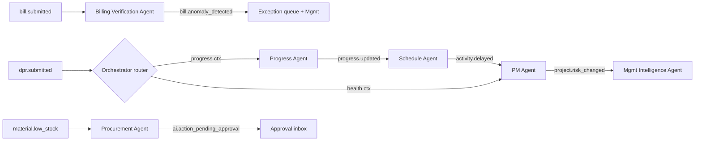

# 11 — Event-Driven Architecture

Mechanism unchanged from `../../03 §4` (transactional outbox → Redis Streams, idempotent consumers, DLQ + replay). This file defines the **AI bindings**: which events wake which agents, and the AI-origin events agents emit back.

## 1. Event catalogue (ERP → AI)

| Event | Emitted by | AI consumers |
|---|---|---|
| `project.created` | tenancy | PM Agent (bootstrap baselines) |
| `dpr.submitted` | siteops | Progress Agent, PM Agent, Safety Agent |
| `progress.updated` / `activity.delayed` | projects | Progress Agent, Schedule Agent, Cost Agent |
| `milestone.certified` | projects | Cost Agent (cost accrual check), Mgmt Agent |
| `material.low_stock` / `material.shortage.predicted` | inventory / Material Agent | Procurement Agent, Mgmt Agent |
| `stock_movement.created` | inventory | Material Intelligence Agent |
| `purchase_order.delayed` | procurement | Procurement Agent |
| `purchase_requisition.created` | procurement (AI or human) | Procurement Agent (tracking) |
| `contractor.performance_declined` | Contractor Agent | PM Agent, Mgmt Agent |
| `quality.ncr_created` | quality | Contractor Agent, PM Agent |
| `safety.incident_created` | safety | Safety Agent, PM Agent, Mgmt Agent |
| `bill.submitted` | contractors | **Billing Verification Agent** |
| `bill.anomaly_detected` | Billing Verification Agent | Procurement, Mgmt, exception queue |
| `budget.threshold_exceeded` | Cost Agent | Mgmt Agent, exec dashboard |
| `project.risk_changed` | PM Agent | Mgmt Agent, exec dashboard |
| `document.uploaded` / `document.version_created` | docs | Document Intelligence Agent |
| `booking.confirmed`, `demand.due`, `receipt.bounced` | sales/finance | Mgmt Agent (brief), CRM journeys (existing) |
| `approval.granted` / `approval.rejected` (source=ai_agent) | workflow | issuing agent (feedback loop, quality signal) |

## 2. AI-origin events (agents → system)

Agents emit standard events through the tool layer (`emit_event@v1`, L3) — never direct publishes: `ai.insight_created`, `ai.recommendation_ready`, `ai.anomaly_detected`, `ai.forecast_updated`, `ai.report_generated`, `ai.action_pending_approval`, `ai.action_executed`, `ai.agent_suspended`. Consumers: notification hub, dashboards (D13), audit.

## 3. Event → AI workflow routing

Delivery semantics: at-least-once + consumer idempotency (`processed_events`); per-agent concurrency caps; poison events → DLQ with replay UI; event schemas versioned `type.vN` (agents pin minor versions, same as ERP consumers).

## 4. Scheduled (cron) triggers — BullMQ, IST

| Schedule | Agent/workflow |
|---|---|
| 05:30 daily | Mgmt Agent — CEO Daily Brief (13 §2) |
| 06:00 daily | Procurement + Material Agents (requirements, days-of-cover) |
| nightly 01:00 | Progress Agent (planned-vs-actual), Cost Agent (EVM/EAC), KPI snapshot rollups |
| Monday 07:00 | Mgmt Agent — Weekly Project Review |
| 1st monthly | Mgmt Agent — Management Review; Contractor Agent scorecards |
| continuous | event-triggered agents per §1 |

## 5. Ordering & correlation

Per-aggregate ordering (Redis Streams consumer groups keyed by `project_id`); `correlation_id`/`causation_id` chain events → agent runs → tool calls → approvals → ERP writes (one trace in observability, `21 §5`).
