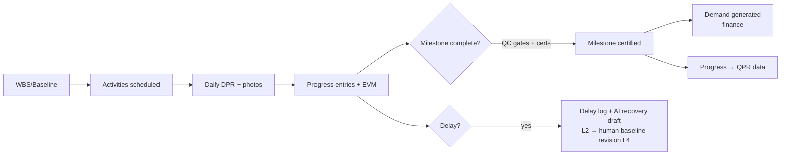
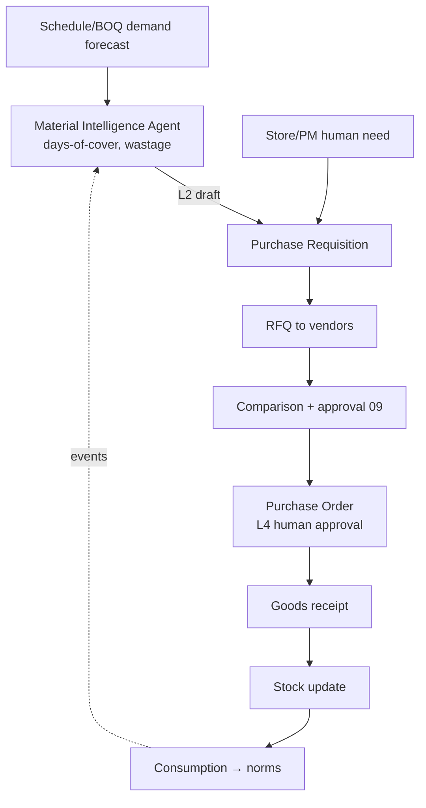
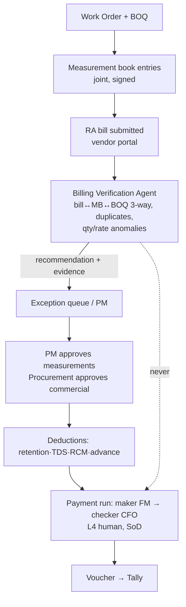

# 12 — Workflow Architecture

Business workflows (deterministic, in the ERP) and AI workflows (event-triggered agent runs) — separate engines, one audit trail. The approval engine (`../../09`) is shared.

## 1. Construction workflow (deterministic core)

## 2. Procurement workflow (with AI preparation)

AI role: predicts shortage, drafts PRs (L2), monitors PO aging (`purchase_order.delayed`), never issues POs.

## 3. Contractor billing workflow (AI verifies, humans approve — critical rule)

**AI must NOT autonomously authorize high-value financial payments** — the Billing Verification Agent stops at a recommendation; the approval/payment chain is entirely human (`10 §2/§5`).

## 4. AI approval workflow

Full sequence + card spec: `09-ai-tool-contracts.md §4`. Summary: agent → policy gate → approval_request with evidence card → human APPROVE/REJECT/MODIFY/REQUEST REVIEW → idempotent execution → immutable audit. One inbox for human and AI-sourced approvals (source-tagged).

## 5. Workflow engineering rules (both engines)

| Rule | Mechanism |
|---|---|
| Idempotency | idempotency keys on all mutations; consumer dedupe |
| Recoverability | outbox, DLQ + replay, compensation steps on multi-step flows |
| State as data | workflows = state machines in `workflow` schema (07 `../../03 §3` engine reused) |
| SLA everywhere | timers + escalations (`../../07 §7`) |
| Human checkpoints | authority matrix is the single source (`../../09 §2`) |
| Audit | workflow transitions + AI decisions in the same `audit_event` stream |
| Versioning | workflow defs + prompts versioned; in-flight instances pin versions |
