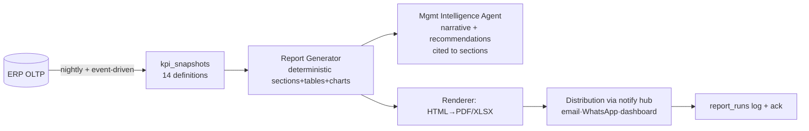

# 13 — Reporting Architecture

Automated reporting engine: reports generated **from ERP data** (KPI snapshots, `05 §6`) — never from an LLM's arithmetic. LLM writes narrative around computed numbers; every number links to its computation.

## 1. Pipeline

Idempotent: `report_runs(tenant, def, period)` unique; re-run regenerates safely. Schedules per `11 §4` (05:30 daily, Mon weekly, 1st monthly).

## 2. Report specifications

### Daily — CEO Daily Brief (05:30 IST)
1. Portfolio health strip (D1 KPIs: collections, sales, cash, escrow utilisation, SPI/CPI range)
2. Progress: milestones certified yesterday, delayed activities (top 5), DPR submission compliance
3. Budget & procurement: spend yesterday, PRs/POs pending approval, shortages predicted ≤14 d
4. Critical issues: open P0/P1 (safety, quality, recon exceptions), SLA breaches
5. Risks: `project.risk_changed` summary, cost-forecast breaches
6. Today's decisions: pending approvals (human + AI-sourced, by value)
7. AI recommendations (each with evidence + one-tap approve where L4)

### Weekly — Project Review (per project, Monday)
Planned vs actual (S-curve) · schedule variance + critical-path movement · cost variance + EAC vs BAC · contractor scorecards · material status (cover, late POs) · quality (NCRs raised/closed, first-pass) · safety (incidents, CAPA aging) · risks · recovery actions with owners.

### Monthly — Management Review (portfolio)
Financial performance (revenue, collections, margins) · construction progress per project · forecast completion & forecast cost · project profitability · major risks (ranked) · contractor performance league · procurement & inventory health · strategic recommendations (evidence-cited).

### On-demand
Ad-hoc packs via `generate_report@v1` (agent L3) and human report builder; exports reuse panel registry (`../../08 §Impl`).

## 3. Render & delivery

HTML template → PDF (Chromium render worker) / XLSX; per-tenant branding; WhatsApp delivery ≤ 2 pages (summary card + PDF); email full; dashboards always-current versions (D1/D2/D5/D8). Distribution lists are tenant-managed; **AI never adds recipients** (L5 promotional rule).

## 4. Analytics layer & semantic integrity

All report numbers come from `kpi_snapshots` produced by deterministic SQL on the read replica; narrative references the snapshot version (`as-of` stamp). If a snapshot is stale > 24 h, report degrades to "data pending" for that section — never fabricates. Ad-hoc analytical questions go through ask-AI → semantic layer (`22 §3`), scoped by permissions.
