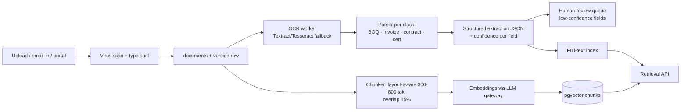

# 15 — Document Intelligence (OCR / RAG) Architecture

Knowledge architecture for contracts, BOQs, drawings, specifications, policies, project documents, vendor documents, invoices, and inspection documents. Storage: S3 (files, KMS) + PostgreSQL `knowledge` schema with **pgvector** (chunks + embeddings) — no separate vector DB at this scale (ADR-AI4).

## 1. Ingestion pipeline

## 2. Parsing & extraction targets

| Doc class | Extraction schema | Consumers |
|---|---|---|
| BOQ | items: code, description, unit, qty, rate, amount; revisions | Procurement, Cost Agent, Billing Verification |
| Invoice/RA bill | vendor, WO ref, line qty/rate, taxes, deductions context | Billing Verification, AP |
| Contract / work order | parties, scope, rates, retention %, DLP, RA cycle, EOT clauses, LD | Procurement, Document Agent clause alerts |
| Drawing | number, revision, discipline, supersession | Projects drawing register |
| Certificate (Form 3/4, NOC, licences) | issuer, dates, validity, conditions | Compliance expiry engine |
| Policy/SOP | sections, applicability | KB answers |

Extraction output **never writes directly to finance/procurement** — lands in review queues (`08 #11` boundary).

## 3. Chunking, metadata, embeddings

Layout-aware chunking (preserve tables: BOQ lines are atomic chunks with row coordinates); metadata per chunk: `tenant_id, project_id, document_id, version_id, doc_class, section, page, permissions_summary, content_hash`. Embeddings: text-embedding model via gateway (dimension 1536); re-embed on new document **version** only; old versions retained but excluded from default retrieval.

## 4. Retrieval with permissions (hard rule)

Every retrieval: `WHERE tenant_id = current AND project_id IN (caller_scope)` — applied **inside** the retrieval API, not by the model. Hybrid search: pgvector HNSW (semantic) + Postgres FTS (exact, codes like BOQ item numbers), reciprocal-rank fusion; `retrieval_log` records query, caller (agent/user), filters, chunks returned, citations rendered. **An answer without citations is rejected at the API level for KB-mode questions.**

## 5. Citations & versioning

Answers cite `[doc name, version, page/section]` with deep links to the document viewer; comparison answers (contract vs standard, bill vs BOQ) show diffs side-by-side. Document versioning: new version supersedes; retrieval defaults to latest approved version; "as-of" queries pin versions for audit replay.

## 6. Security & quality controls

Virus/malware scan before any parsing; OCR output treated as **untrusted input** (prompt-injection defense: document text is wrapped, never concatenated into system prompts; instruction-like strings are stripped and logged — `16 §5`); PII (Aadhaar/PAN) detected → masked before embedding; confidence thresholds route low-confidence extractions to humans; eval suite of 50 golden documents (BOQ, invoice, contract) with exact-field assertions (`25 §4`).

## 7. Scale path

≤10M chunks / 50 tenants on pgvector (measured plan); beyond → dedicated vector store behind `RetrievalPort` (ADR-AI4 lists trigger and migration).
