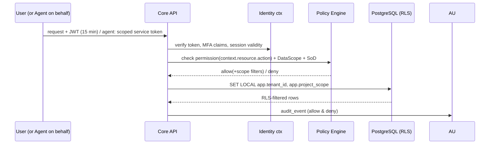

# 16 — Security Architecture (Application + AI)

Application security inherits `../../03 §5` unchanged (WAF, MFA, field-level PII encryption, secrets management, SDLC gates). This file adds the **AI security plane** and the end-to-end authorization flow.

## 1. Authentication & authorization flow

Agents: service identity `ai:<agent>@vN` with scopes = agent allowlist ∩ (user's scopes if user-triggered). **AI never bypasses ERP permissions** — enforced by the same policy engine, verified by the authz matrix fuzz suite extended with agent identities (`25 §2`).

## 2. Permission surfaces

| Surface | Control |
|---|---|
| API authorization | `@RequirePermission` guards + DataScope injection (03 §2) |
| Agent tool permissions | tool allowlist + autonomy gate (09/10) |
| Financial approval permissions | authority matrix + SoD (09 §2/§6) |
| Document permissions | folder ACLs + RLS; RAG retrieval joins permission filter (15 §4) |
| Portal users | OTP sessions, record-scoped (own unit/vendor/partner data only) |

## 3. Data protection

PII field-level encryption (Aadhaar, PAN, bank) via KMS data keys; S3 SSE-KMS; secrets in AWS Secrets Manager with rotation; TLS everywhere; audit append-only 7-year retention; DPDP consent ledger governs AI use of customer data (agents read consent flags; L5 blocks promotional autonomy).

## 4. Rate limiting & abuse prevention

Redis sliding windows (03 §1): ERP 100/min/user; portals 30/min; ask-AI 20/h/user; per-agent tool-write caps (09 §5); webhook signature verification + replay protection; anomaly alerts on unusual export volume (DLP signal).

## 5. AI-specific threat model & controls

| Threat | Vector | Controls |
|---|---|---|
| **Prompt injection** | malicious document/DPR text/vendor bill content, portal messages | document text = untrusted data: wrapped in delimiters, instruction-stripped, never concatenated into system prompts; tool-calling only via typed schemas (model cannot free-form act); injection probes in eval suite |
| **Malicious documents** | uploaded files | virus scan, type sniffing, size caps; OCR sandbox; no macro formats |
| **Tool abuse / unauthorized actions** | agent loops, arg tampering | allowlists, L5 registry rejections, per-agent rate caps, cross-field arg validation, SoD unaffected |
| **Cross-project / cross-tenant data access** | retrieval or read tools | RLS + retrieval WHERE scope + tool tenant guard; fuzz tests prove leakage impossibility |
| **Data leakage to providers** | prompts | LLM gateway masking (Aadhaar/PAN/bank → tokens), tenant AI-consent flags, no-training API terms, regional routing |
| **Hallucinations / wrong facts** | all generative outputs | evidence-mandatory recommendations, citation-required KB answers, deterministic validators recompute claims, confidence thresholds, human approval on L4 |
| **Incorrect calculations** | model arithmetic | principle 6: LLM never computes money/dates; domain code computes, model explains |
| **Model failures / provider outage** | API | gateway failover, timeouts, deterministic fallbacks, agent suspension alerts |
| **Unsafe recommendations** | low-confidence actioning | routing table (10 §3): low confidence → never acts; suspension on denial bursts |
| **Approval spoofing** | WhatsApp card abuse | approvals only via authenticated session + MFA step-up for financial; card buttons map to server-verified identity |
| **Audit gaps** | — | `ai_actions`/`ai_decisions` append-only; deny actions also audited; replay from pinned prompt versions |

## 6. AI governance operations

Quarterly autonomy-policy review (with approval analytics `../../09 §7`); model/prompt change management (versioned, staged rollout, shadow evals before promote); incident class "AI safety incident" with severity ladder and kill-switch per agent (registry toggle) and global AI pause switch; red-team exercise before each AI phase exit (`25 §4`, `26`).
