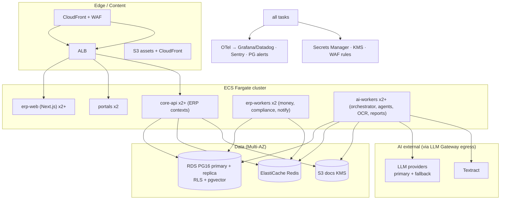

# 23 — Deployment Architecture

AWS ap-south-1 (Mumbai, DPDP-aligned), Terraform IaC, GitHub Actions — inherits `../../02 §2` and `phases/phase-0 WP-0B`. AI layer deploys into the same topology (no new runtime paradigm).

## 1. Topology

## 2. Services & scaling

| Service | Min | Scaling signal | Notes |
|---|---|---|---|
| erp-web / portals | 2 tasks | CPU + request count | stateless, CDN |
| core-api | 2 tasks | p95 latency, CPU | launch-day burst 500 rps (`../../02 §6`) |
| erp-workers | 2 | queue depth P0 queues | money jobs never starved |
| ai-workers | 2 (prod) | `q-ai-*` depth + budget gate | concurrency caps per agent; scale-out off business hours analysis |
| Report renderer | 1–2 | `q-reports` depth | Chromium in sidecar/task |

## 3. Environments & promotion

dev (PR previews) → staging (UAT + AI shadow: agents run read-only on production-like data) → prod. Trunk-based, feature flags per tenant, weekly train, expand-contract migrations. **AI rollout is separately gated**: prompt/config versions promoted through eval suite before enabling per tenant (`25 §4`, `28 §3`).

## 4. AI-specific deployment concerns

- Egress: LLM calls via NAT gateway with allowlisted provider domains; gateway logs destination/tenant/tokens (no payloads).
- pgvector: HNSW index memory budgeted on RDS instance sizing; embedding batch jobs throttled off-peak.
- Model credentials per provider in Secrets Manager; per-tenant budget enforcement at gateway (`28 §2`).
- Model-region/DPDP: providers configured for no-training terms; regional routing documented.

## 5. IaC & CI/CD

Terraform modules: network, ecs, rds(+parameters for pgvector), redis, s3+kms, waf, secrets, observability, budgets/alerts. Pipelines: lint→type→unit→integration (Testcontainers)→build→scan(SAST/SCA/IaC)→deploy. AI pipelines add: eval suite gate + prompt-version artifact promotion (25 §4).
