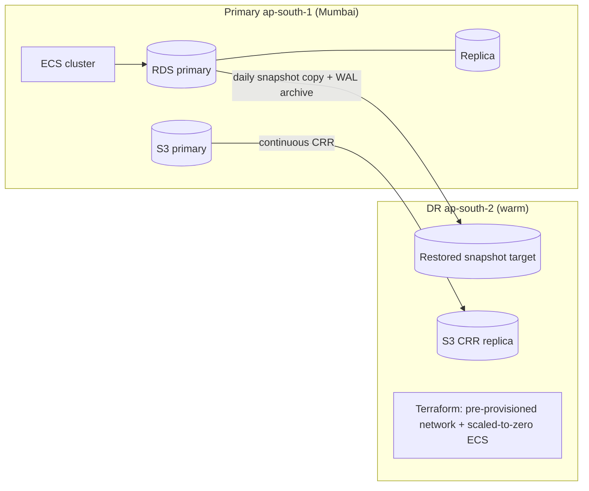

# 24 — Disaster Recovery & Backup

## 1. Recovery objectives

| Tier | Assets | RPO | RTO |
|---|---|---|---|
| T0 Money/compliance | Postgres (demands, receipts, escrow, statutory), approval/audit tables, AI decision/action tables | ≤15 min (PITR WAL) | ≤4 h |
| T1 Operations | remaining OLTP schemas | ≤1 h | ≤4 h |
| T2 Files | S3 documents (versioned, cross-region replication) | ≤1 h | ≤8 h (presigned/CDN degraded OK) |
| T3 Analytics | marts, KPI snapshots | ≤24 h (rebuild) | ≤24 h |

## 2. Backup matrix

| Asset | Mechanism | Frequency | Retention | Restore drill |
|---|---|---|---|---|
| RDS | automated snapshots + PITR | continuous WAL, daily snapshot | 35 d PITR, 12 monthly | monthly (evidence logged) |
| Cross-region copy | snapshot copy → ap-south-2 | daily | 90 d | quarterly |
| Redis | snapshots (queues rebuildable — queues are **not** state of record) | 6 h | 7 d | n/a (rebuild) |
| S3 | versioning + cross-region replication | continuous | versioned forever, lifecycle cold at 180 d | quarterly sample |
| Secrets/IaC | Terraform state + secrets in AWS managed stores | on change | full | n/a |
| AI assets | prompts/config versions in git; `ai_decisions/ai_actions` in T0 backup | on change / continuous | 7 y | included in drills |

## 3. DR architecture

Runbook: detect → declare (severity ladder) → promote/restore DB → deploy images (ECR, immutable tags) → repoint DNS → smoke suite (booking, demand, approval, ask-AI) → reconcile queues (replay outbox DLQ) → comms. RTO evidence from quarterly game days (`../../03 §6` inherits).

## 4. AI-specific recovery

- Agents are stateless workers — resume from queues + `agent_runs` unfinished markers; duplicate runs deduped by idempotency keys.
- LLM provider regional outage → gateway failover; total outage → agents suspend (deterministic alerts continue), no ERP impact (AI is additive).
- `ai_decisions`/`ai_actions` restore with T0 — audit chain never lost; pending approvals re-surface on recovery (expiry clock paused during declared DR window, documented per incident).

## 5. Data retention (summary)

Audit + AI decisions 7 years; statutory/financial records indefinite (no hard delete); operational memory 90 d; agent memory 180 d; logs per `21 §5`; backups per matrix above — all DPDP-aligned (erasure requests honored outside statutory carve-outs, `../../12 §10`).
