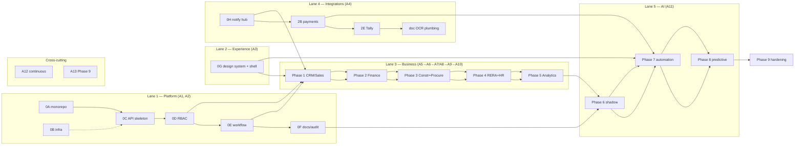

# 32 — Multi-Agent Development Division

How the build is divided across **parallel coding agents** (AI coding agents and/or human engineers in the same roles). Work packages come from `../../phases/` (Phases 0–5) and `27-implementation-roadmap.md` (Phases 6–9); budgets from `31-effort-estimation.md`. Division rules extend `../../06 §3`.

## 1. Agent roster (13 roles, ≤6 concurrent)

| Agent | Role | Owns (paths) | Hours | Weeks active |
|---|---|---|---|---|
| **A0 Orchestrator** | Human tech-lead + coordinator | dispatch, review, merge order, ADRs, §contract changes | — | all |
| **A1 Infra** | Repo, Terraform, CI/CD, observability, game days | `infra/`, `.github/`, `docker/` | 400 | W1–4, then ongoing |
| **A2 Core Platform** | API skeleton, identity/RBAC, workflow engine, docs/audit | `services/core-api/src/{tenancy,identity,workflow,docs,audit}`, `packages/{permissions,money-utils,config}` | 530 | W1–10 |
| **A3 Experience** | Design system, ERP shell, portals, field PWA, approval cards | `packages/ui`, `apps/*` shells, `apps/erp-web/app/(shell|portals)` | 700 | W2–40 |
| **A4 Integrations** | Notification hub, WhatsApp/email/SMS, payments/eNACH, eSign, Tally, telephony, lead sources | `src/notify`, `src/integrations` | 620 | W8–28 |
| **A5 CRM/Sales** | Leads, pricing, inventory, bookings, AFT, partners, commissions | `src/{crm,sales}`, `apps/erp-web/app/(crm\|sales)` | 860 | W5–14 |
| **A6 Finance** | Demands, receipts, escrow, collections, payment runs, refunds | `src/finance`, `apps/erp-web/app/(finance)` | 700 | W11–24 |
| **A7 Construction** | Planning/WBS/CPM, site ops, milestones, QC, safety | `src/{projects,siteops,quality,safety}`, field PWA routes | 640 | W15–26 |
| **A8 Supply Chain** | Procurement, BOQ linkage, inventory, contractors, RA bills, vendor portal | `src/{procurement,inventory,contractors}` | 660 | W15–28 |
| **A9 Compliance/HR** | RERA/QPR, statutory, DPDP, HR/payroll/incentives | `src/{compliance,hr}` | 720 | W21–30 |
| **A10 Analytics/Marketing** | Campaigns/attribution, KPI marts, semantic layer, dashboards D1–D12 | `src/{marketing,reporting}`, dashboard routes | 500 | W27–34 |
| **A11 AI Systems** | Orchestrator, policy engine, LLM gateway, RAG, 12 agents, evals | `src/ai-*`, `knowledge/` schema | 2,100 | W27–44 |
| **A12 QA/SDET** | Test authoring, E2E, load, authz fuzz, eval execution | `tests/`, `e2e/`, CI test stages | 500 | W2–46 |
| **A13 Security** | Hardening, VAPT closure, red-team, DR drills support | cross-cutting (via A0-sequenced PRs) | 320 | W40–46 |

**Hour reconciliation:** agent hours sum to **9,250 h** — an allocation of the 10,290 h program pool (`31 §10`). The remainder (~1,040 h) is held by A0 as program contingency (960 h) plus orchestration float; A3's allocation includes the UX-design budget it executes.

Shared paths with **single-owner rule**: `package.json`/lockfile + Prisma schema root + OpenAPI index + sidebar IA (`22 §1`) → **A2**; others change them only through A0-approved PRs. Each agent owns its DB schema files; **migration merge order is set by A0** (expand-contract, one migration train per day).

## 2. Parallel lanes & dependency graph



**Lane rules:** lanes are independent except at named gates (arrows above). Each agent pulls the next `ready` WP in its lane; a WP is `ready` when its work-order prerequisites are merged. Max 6 agents in flight — beyond that, queue (review bandwidth of A0 is the constraint, not coding speed).

## 3. Dispatch schedule (baseline 44–48 weeks)

| Weeks | Concurrent agents | Dispatch (WP → agent) | Phase budget |
|---|---|---|---|
| 1–4 | A1, A2, A3, A12 | 0A+0B→A1 · 0C→A2 · 0G→A3 · test scaffolds→A12; then 0D→A2, 0E→A2 (serial: 0C→0D→0E) | 920 h |
| 5–12 | A2, A3, A4, A5, A12 | 0F→A2 · 0H→A4 · 1A→1F→A5 (1A→1C→1D serial; 1B,1E parallel) · portal slice→A3 | 860 h |
| 11–16 | A4, A6, A3, A12 | 2A→2C→2F→A6 · 2B→2E→A4 · 2D→A3 | 760 h |
| 15–22 | A7, A8, A6, A4, A12 | 3A→3B→3C→A7 (3B serial; 3C parallel) · 3D→3E→3G→A8 (3F,3H slots) · 3H→A6 · OCR→A4 | 1,000 h |
| 21–28 | A9, A4, A12 | 4A→4B→A9 (4C–4E,4H parallel; 4F→4G serial) · doc OCR→A4 | 720 h |
| 27–32 | A10, A12, A11(start) | 5A→5C→A10 · 5B→A10 · **P6: orchestrator/gateway/RAG→A11** | 500 + 660 h |
| 31–36 | A11, A3, A4 | P6 shadow agents + evals→A11 · D13 read-only→A3 | (P6 total) 1,100 h |
| 35–40 | A11, A3, A4, A12 | P7: L3/L4 execution→A11 · approval cards→A3 · WhatsApp approvals→A4 · 9 agents→A11 (2 concurrent WP slots) · red-team→A12 | 980 h |
| 39–44 | A11, A10 | P8: predictions→A11 · forecast dashboards→A10 | 460 h |
| 43–46 | A13, A1, all | P9: VAPT→A13 · game days→A1 · migration kit→A2+PO · UAT/cutover | 680 h |

**Compressed plan (30–38 weeks, agent-augmented per `31 §11`):** raise concurrency to 6 agents and pull Lane-4 work forward; P6 shadow starts W20 (after Phase 4 data exists on staging); same gates — compression comes from parallelism and mechanical WPs, **not** from skipping evals, red-team, or money-correctness gates.

## 4. Dispatch packet (what each agent receives)

```
WP: phase-1/WP-1D (Bookings & AFT)            Budget: 180 h
Read first: phases/phase-1-crm-sales.md (§WP-1D), docs/architecture/09-ai-tool-contracts.md
Context: §contract events (booking.confirmed.v1 …), 03 §1 API standards, 04 §5 flow 1
Dependencies merged: WP-1C (inventory/pricing), WP-0E (workflow engine)
You own: src/sales/**, apps/erp-web/app/(sales)/bookings/**
Do not touch: shared paths (A2-owned), other agents' paths
Deliverables: code + tests + migrations + OpenAPI + demo script per acceptance criteria
Definition of done: ../../06 §5 + WP acceptance + budget noted in PR
```

## 5. Orchestration protocol

1. **Dispatch:** A0 issues the packet; agent works on branch `wp/<phase>-<wp>`; one WP = one PR (target <1,500 changed lines; split if larger).
2. **Gates per PR:** CI (lint→type→unit→integration→contract→scan) + A0 review (mechanical PRs may be reviewed by a reviewer-agent, financial/auth-relevant PRs always human).
3. **Merge cadence:** every lane merges to `main` at least daily; migrations enter the daily train in A0-assigned order; contract tests run on every merge.
4. **Interfaces:** the `§contract` blocks in phase files are frozen; changes require an ADR note + A0 approval; consumers are notified via the event-catalogue diff in CI.
5. **Handoffs between agents** happen only through merged, tested interfaces (events, tools, packages) — never through shared in-flight branches.
6. **Failure:** agent blocked >1 day → WP returns to `ready` with notes; A0 re-dispatches (possibly to a different agent). Budget overrun >20% → `31 §12` re-estimation rule.
7. **Phase exit:** A0 runs the exit demo with the PO (`26` checklist lines), verifies budgets, unlocks the next lane gates.

## 6. Anti-conflict measures

| Risk | Control |
|---|---|
| Two agents editing shared paths | ownership matrix (§1) + CODEOWNERS-enforced reviews |
| Migration collisions | daily migration train, A0-ordered, expand-contract only |
| Contract drift | frozen §contract + OpenAPI/event diff gate in CI |
| Duplicated utilities | `packages/*` additions only via A2 review |
| Context overflow in agents | self-contained work orders + packet (§4); long WPs pre-split by A0 |
| Review bottleneck | max 6 concurrent; reviewer-agent for mechanical PRs; WIP limits per lane |

## 7. Worked example — first two weeks

- D1: A0 dispatches 0A→A1, 0C→A2, 0G→A3, scaffolds→A12 (4 concurrent).
- D2–5: A1 lands monorepo+CI (0A); A2 lands API skeleton with RLS probe suite (0C); A3 lands tokens+primitives; A12 lands test harness + first suites.
- W2: 0B→A1 (staging deploy), 0D→A2 (RBAC), 0G continues (ERP patterns), A12 wires authz fuzz into CI.
- W2 exit: PR preview URL works; first daily migration train executed; lane kanban live.
